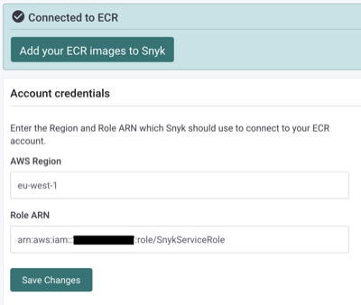
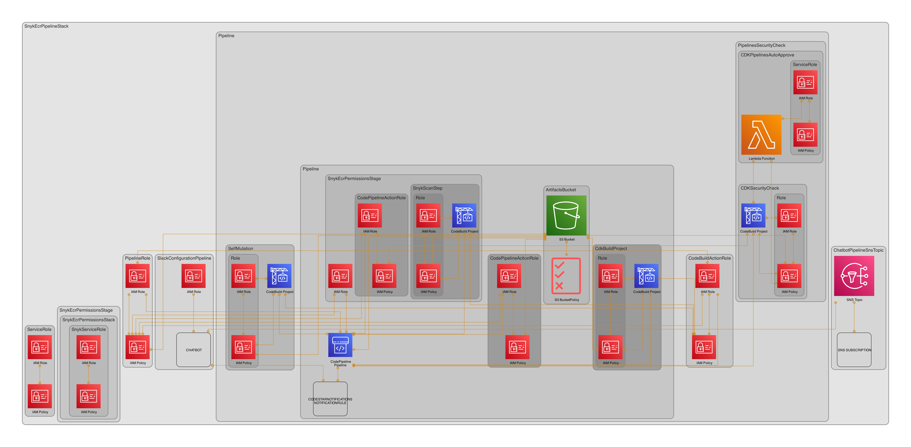

# Snyk ECR Integration

### License

```shell
open ./license/license.html
```

**Configure the integration for Amazon Elastic Container Registry (ECR) scanning in the Snyk dashboard: https://app.snyk.io/.
This enables integration between one Amazon ECR registry and a Snyk organization, so you can start managing your image security.
You will need your Snyk API key, Snyk organization's external id, the Snyk ECR integration user id (get it from your Snyk dashboard), your Codestar connection-arn, optional a Slackchannel id, and this stack to complete the integration.**

**An attempt is made to keep this Stack as generic as possible, with the intention that it can be reused by everyone.**

> **NOTE:**             
> **You can use multiple Snyk organizations, but you can only use one AWS account in one Snyk organization to integrate with ECR.**


### How to run

**Generic variables:**

* **The usual dependencies to run CDK with typescript.**
* **For a new project use `cdk init app --language typescript`**
* **Clone or fork this repository https://bitbucket.org/persgroep/snyk-ecr-permissions/src/main/**

**Optional:**
* **Add the AWS ChatBot subscription endpoint to the AWS Parameter store in Systems Manager: `https://global.sns-api.chatbot.amazonaws.com`, it's a one time operation. The endpoint can be reused
  everytime you set up a slack configuration.**
* **Add your IT Slack Workspace-id to the AWS Parameter store in Systems Manager. This id can be reused everytime you set up a slack configuration.**

**Variables:**

* **Your Snyk API key should already be stored in AWS Secretsmanager, you need it for the Snyk tests in the pipeline.**
* **Add your own Snyk external id to the stack, you can store it first in AWS Parameter store, you can find this id in your Snyk dashboard, under integrations, ECR.**
* **Add your Codestar connection arn to the AWS Parameter store in Systems Manager.**
* * **Get the role arn from the AWS console (IAM) when the deployment has finished, you need it in your dashboard for the connection `arn:aws:iam::[your account id]:role/SnykServiceRole`**



**Optional:**
* **Add your own Slackchannel-id to the AWS Parameter store in Systems Manager.**

---

**When you execute a CDK command, `cdk ls` or `cdk synth`, you will see a terminal output which shows the current account you're working in, like this:**

```shell
AWS region: eu-west-1
AWS account id: 123456789012
AWS codestar arn: arn:aws:codestar-connections:eu-west-1:123456789012:connection/12345678-1234-1234-abcd-abcd1234efgh
AWS account alias: YOUR-ACCOUNT-ALIAS
```

---

**Run the following commands to get the pipeline going:**

```shell
git commit -a
git push
cdk deploy SnykEcrPipelineStack
```

> #### Important!
> Be sure to `git commit` and `git push` before deploying the Pipeline stack using `cdk deploy`!
> The reason is that the pipeline will start deploying and self-mutating right away based on the sources in the repository, so the sources it finds in there should be the ones you want it to find.
>
> **CDK Deploy**                    
> Before creating a change set, `cdk deploy` will compare the template and tags of the currently deployed stack to the template and tags that are about to be deployed and will skip deployment if they
> are identical.
> Use `cdk deploy --force` to override this behavior and always deploy the stack.
>
> **Tip**                           
> If the pipeline fails before it reaches the **Update Pipeline Stage** you have to do a `cdk deploy` local. Then it will pick up the latest code changes again.

---

**Add your repository name to the `CodePipelineSource.connection`:**

```typescript
  const sourceCode = CodePipelineSource.connection('your-repository-name', 'main', {
  triggerOnPush: true,
  connectionArn: codestarConnectionArn,
  actionName: 'SnykEcrPermissions',
});
```

**The AWS environment where the deployment will take place depends on the CLI's current credential settings, to obtain those settings we use the `process.env` variable:**

```typescript
export const env = {
    region: process.env.CDK_DEFAULT_REGION,
    account: process.env.CDK_DEFAULT_ACCOUNT,
};
```

**The CodeStar connection ARN will be imported from the parameter store, you have to add it first!:**

```typescript
    const codestarConnectionArn = StringParameter.valueForTypedStringParameterV2(
    this, '/codestar/connection/arn', aws_ssm.ParameterValueType.STRING, 1);
```

**The Snyk external id will be imported from the parameter store, you have to add it first!:**

```typescript
    const snykExternalId = StringParameter.valueForTypedStringParameterV2(
    this, '/snyk/external/id', aws_ssm.ParameterValueType.STRING, 1);
```

**For the Snyk ECR integration user id, get it from your Snyk dashboard:**

```typescript
  const snykServiceRole = new aws_iam.Role(this, 'SnykServiceRole', {
  description: 'Provides Snyk with read-only access to AWS EC2 Container Registry repositories',
  roleName: 'SnykServiceRole',
  assumedBy: new aws_iam.ArnPrincipal(`arn:aws:iam::[the Snyk ECR integration user id]:user/ecr-integration-user`),
});
```

**You have to provide your own Snyk API key id stored in secretsmanager, you have to add it first! It will be imported through the environment variable in the buildspec.**
**If you do not have an API key you can disable the test in the pipeline, because else it will fail.**

```typescript
  const codeBuildBuildEnvironment = {
  computeType: aws_codebuild.ComputeType.LARGE,
  buildImage: aws_codebuild.LinuxArmBuildImage.fromCodeBuildImageId('aws/codebuild/amazonlinux2-aarch64-standard:3.0'),
  privileged: true,
  environmentVariables: {
    SNYK_TOKEN: {
      type: BuildEnvironmentVariableType.SECRETS_MANAGER,
      value: 'your-snyk-api-key',
    },
  },
};
```

**Optional if you want to be notified: the SlackChannel id will be imported from the parameter store, you have to add it first!:**

```typescript
    const slackChannelId = StringParameter.valueForTypedStringParameterV2(
    this, '/slackchannel/id');
```

**Optional if you want to be notified:  The Slack Workspace id will be imported from the parameter store, you have to add it first!:**

```typescript
    const slackWorkspaceId = StringParameter.valueForTypedStringParameterV2(
    this, '/slackworkspace/id');
```

**Optional if you want to be notified: The AWS ChatBot subscription endpoint url will be imported from the parameter store, you have to add it first!:**

```typescript
    const chatBotSubscriptionEndpoint = StringParameter.valueForTypedStringParameterV2(
    this, '/chatbot/subscription/endpoint');
```

**Extra: Snyk settings:**

Set up you Snyk config local:
Create a `snyk.json` file here: `~/.config/configstore`, it should look like this:

```json
{
  "api": "01234567b-0a0b-1c2c-2d2e-f123456789cfh",
  "org": "your_org_name"
}
```

Check your Snyk config: 
```shell
snyk config
```


### CDK IaC diagram

